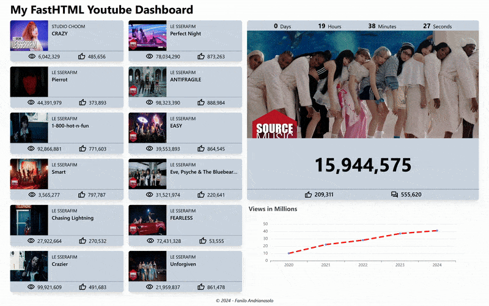

# Dashboard

A scrappy test of FastHTML + Tailwind on a live dashboard usecase.

Mine:



Original:


It's scrappily unoptimized: layout is not absolutely responsive, some component refactoring to do, can probably optimize with SSE, numbers are not pulled from Youtube...

This was mostly to get a feel on how FastHTML/TailwindCSS works.

## Run

Uses [uv](https://docs.astral.sh/uv/guides/projects/) for environment management

```
uv run app.py
```
